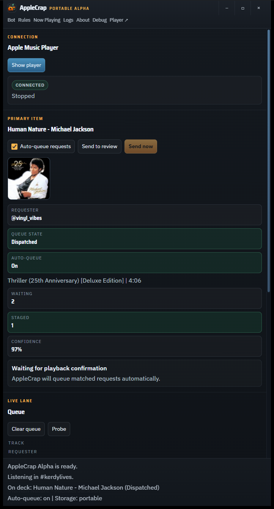
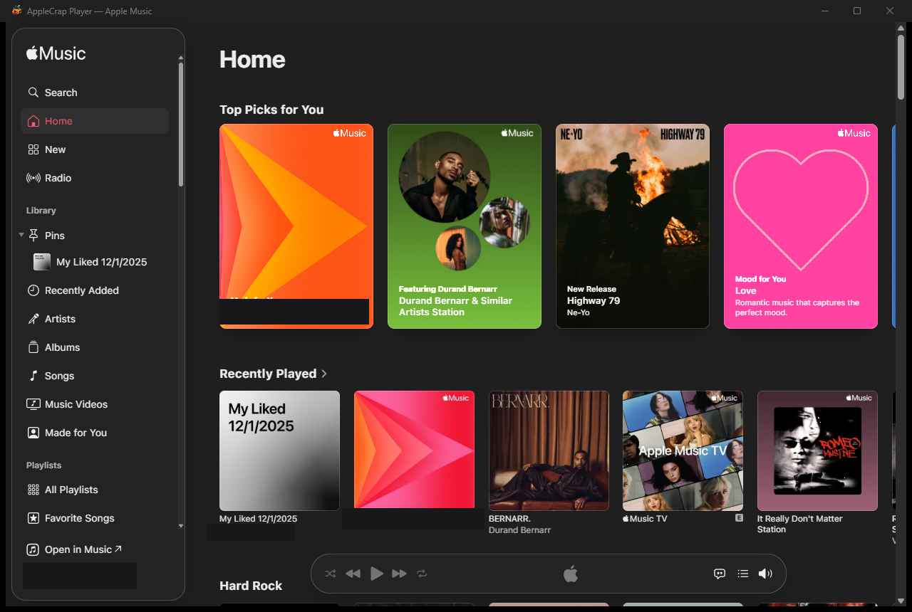

# AppleCrap Alpha

AppleCrap Alpha is a portable Windows app for taking song requests from Twitch chat and handing them off to Apple Music. It is built for streamers who want a small request desk beside their stream setup without running a full bot dashboard in the browser.

> Alpha means usable, but still early. Expect sharp edges.

## Download

- ⬇️ [Download AppleCrap Alpha for Windows](https://github.com/kerdylives-beep/applecrap/releases/download/v0.3.1-alpha.1/AppleCrap.Alpha.zip)
- 📦 Latest portable zip: `v0.3.1-alpha.1`
- 🪟 Unzip it, run `AppleCrap Alpha.exe`, and keep the `data` folder beside it.

## What It Does

- 🎵 Listens for Twitch chat song requests like `!request Human Nature Michael Jackson`
- 🔎 Looks up likely Apple Music matches automatically
- 🧾 Keeps a live queue of requested songs
- ✅ Lets you approve, remove, or manually review requests
- 🎧 Queues matched tracks straight into Apple Music as Play Next, so they play automatically and the streamer's playlist resumes once requests run out
- 🧰 Exports diagnostics if something goes sideways
- 💾 Stores data in the portable folder when possible

## Who It Is For

AppleCrap is for streamers who:

- use Twitch chat
- play music through Apple Music
- want viewers to request songs without manually copying every title
- prefer a portable app over a traditional installer
- are okay with testing an alpha build

It is probably not for you yet if you need a polished, signed, one-click production app.

## Screenshots

The request desk — live queue, match confidence, and auto-queue status at a glance:



The embedded Apple Music player — sign in once, then it can stay hidden all stream while requests queue into it:



> These shots use the current alpha look; a visual refresh is planned.

## Requirements

- 🪟 Windows
- 🌐 Microsoft WebView2 Runtime
- 🎶 An Apple Music subscription (you sign in once, inside the app's own Player window)
- 💬 A Twitch bot account
- 🔑 A Twitch OAuth token for that bot account

The Apple Music for Windows desktop app is **not** required and is not used — AppleCrap plays music through its own embedded Apple Music web player.

The app asks for:

- Twitch channel name
- bot username
- bot OAuth token
- request command, usually `!request`

## How To Use

1. Download `AppleCrap Alpha.zip` from a release, unzip it somewhere you can write files, and run `AppleCrap Alpha.exe`.
2. Click **Player ↗** in the title bar to open the embedded Apple Music player, and sign in to Apple Music. You only need to do this once — the sign-in persists across restarts.
3. Enter your Twitch bot settings and connect the bot.
4. That's it. Matched requests auto-queue into Apple Music in order (FIFO), each one is confirmed once it actually starts playing, and the streamer's own playlist picks back up automatically once the request queue is empty.

Portable storage uses `./data` beside the executable. If that folder is not writable, the app falls back to Local AppData and tells you in the UI.

## Chat Commands

Default request command:

```text
!request song title artist
```

Examples:

```text
!request Human Nature Michael Jackson
!request Freefall Durand Bernarr
!request https://music.apple.com/us/album/freefall-feat-durand-bernarr/1490035834?i=1490036368
```

Remove your latest request:

```text
!remove
```

Check what's currently playing:

```text
!song
```

Check your position in the queue and a preview of what's up next:

```text
!queue
```

Skip the current track (mods/broadcaster only):

```text
!skip
```

## Safety Notes

- 🔐 Your Twitch token is stored locally in the app data file.
- 🧼 Diagnostics exports redact OAuth tokens.
- 🚪 Track links are limited to Apple Music.
- 🎚️ Auto-queue can be paused from the dashboard; a "Send now" action is always available for the front request when you want manual control.

## Building From Source

Most users do not need this section. It is here for developers and testers.

Install dependencies:

```bash
npm install
```

Run the frontend:

```bash
npm run dev
```

Run checks:

```bash
npm run lint
npm test
npm run build
```

Run the Tauri app in development:

```bash
npm run tauri:dev
```

Build the portable package:

```bash
npm run tauri:portable
```

The portable output is created at:

```text
release/portable/AppleCrap Alpha.zip
```

## Project Layout

- `src/` - React app, UI, typed Tauri bridge, and client state
- `src-tauri/` - Rust app shell, persistence, Twitch IRC, Apple Music lookup, the embedded player bridge, and diagnostics
- `scripts/` - icon and portable packaging helpers

## Status

AppleCrap Alpha is early software. The core queue workflow is the priority:

```text
Twitch request -> Apple Music match -> auto-queue (Play Next) -> playback confirmation
```

Bug reports, screenshots, and real streamer workflow notes are very welcome.
